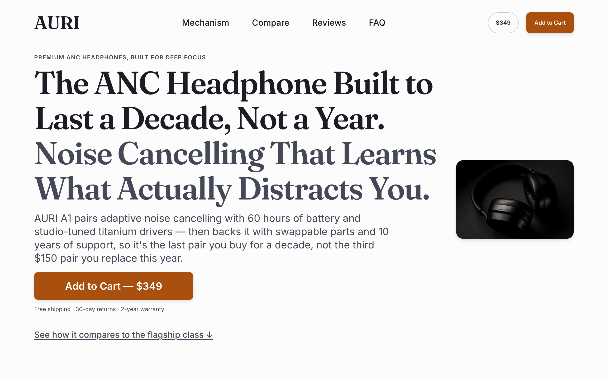
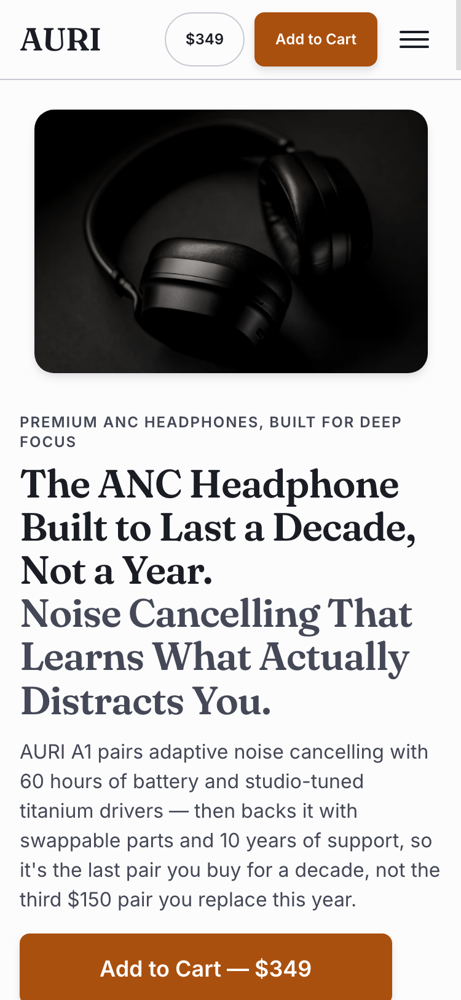

# Conversion Craft

> A complete conversion-design team for Claude Code: **9 agents**, **12 skills**, **3 mechanical QA gates** — research-backed rules distilled from 2024–2026 design-award winners and Baymard / Nielsen Norman Group / CXL conversion research, enforced down to the **rendered pixel** by tooling that fails the build.

Conversion Craft turns Claude Code into a team that researches, designs, writes, builds, critiques and QA-checks high-converting sales pages. Every rule in every skill is operational and checkable ("body line length 45–75ch", never "comfortable line length"), carries its source, and is confidence-tagged `[LAW]` / `[FRAMEWORK]` / `[TREND-2026]`.

## Why this exists

- **Research-backed, not vibes-backed** — the knowledge base was distilled from award-circuit analysis (Awwwards, FWA, CSSDA, Webby, D&AD) and conversion research (Baymard Institute, NN/g, CXL), with fabricated-statistic traps explicitly flagged and excluded.
- **Adversarial by design** — an opus-powered Art Director whose only job is to find what's wrong, a CRO specialist auditing the path to purchase, and a QA Inspector who measures instead of opining.
- **Mechanically enforced** — three gates fail the build, not the vibe check: `spacing-lint.mjs` (design-token discipline, 4px grid — zero raw px/hex/ms values), `contrast-check.mjs` (WCAG contrast assertions declared next to the tokens themselves), and `geometry-audit.mjs` (headless Chrome measures the **rendered page** at 375/768/1280 — form-row alignment within 1px, no horizontal overflow, 44px touch targets, consistent button heights, no squished images). Source checks catch what you wrote; the geometry audit catches what the browser actually drew.

## Installation

### Claude Code (recommended)

```
/plugin marketplace add mmanja84/conversion-craft
/plugin install conversion-craft@conversion-craft
```

Skills become available namespaced as `/conversion-craft:<skill-name>`, and the nine agents join your Agent tool roster.

### Without installing

Clone the repo and copy `agents/`, `skills/` and `tools/` into your project's `.claude/` directory (`skills/` → `.claude/skills/`, `agents/` → `.claude/agents/`), or simply work from the repo root — it self-loads via `.claude/` symlinks.

## Quickstart

```
Build a landing page for <your product>. Use the conversion-craft workflow:
marketing-strategist first (positioning + message hierarchy), then
design-system-architect (tokens.css) and copy-chief in parallel, then
ui-craftsman builds, art-director + cro-specialist critique the RENDERED
page at 375px and 1280px, qa-inspector runs the lint gates last.
```

## The team

| Agent | Model | Role |
|---|---|---|
| `research-scout` | haiku | Broad web reconnaissance — sources, award winners, raw findings |
| `research-analyst` | sonnet | Distills sources into measurable rules with citations |
| `marketing-strategist` | sonnet | Positioning (Dunford), offer architecture, message hierarchy |
| `design-system-architect` | sonnet | Token system: OKLCH color ramps, type scale, spacing grid |
| `copy-chief` | sonnet | Headlines, product copy, CTAs, microcopy — formula-driven |
| `ui-craftsman` | sonnet | Semantic HTML + CSS from tokens; zero magic numbers |
| `cro-specialist` | sonnet | Product-page anatomy, checkout flow, friction hunting |
| `art-director` | opus | Adversarial critic — hierarchy, rhythm, color discipline, genericness |
| `qa-inspector` | sonnet | Runs the gates; measurements beat opinions |

## The skills

| Skill | Use for |
|---|---|
| `design-tokens` | Color scales with contrast roles, spacing grid, type scale, shadows, durations |
| `typography-craft` | Scale ratios, pairing, measure, fluid type, font loading |
| `layout-composition` | Grid, spacing rhythm, above-fold anatomy, section order |
| `navigation-search` | Headers, menus, category pages, faceted search |
| `product-page-cro` | Gallery, price display, CTA, social proof, variants, structured data |
| `checkout-trust` | Cart→checkout flow, forms, wallets, cookie consent, footer trust |
| `motion-performance` | Durations, easings, scroll reveals, Core Web Vitals budgets, images |
| `copy-chief` | Copy formulas, CTA language, objection handling |
| `marketing-strategy` | Positioning, awareness stages, page-level persuasion sequence |
| `demo-assets` | Sourcing and art-directing photography; no abstract vector "product art" |
| `art-director-review` | The adversarial review rubric with severity levels |
| `pixel-qa` | The mechanical QA protocol — gates, a11y checklist, coverage rules |

## QA gates

```bash
node tools/spacing-lint.mjs tokens.css styles.css   # token discipline + 4px grid
node tools/contrast-check.mjs tokens.css            # WCAG assertions: /* @contrast --fg on --bg >= 4.5 */
node tools/geometry-audit.mjs http://localhost:4173 # rendered pixels at 375/768/1280 (system Chrome, zero deps)
```

All three exit non-zero on any violation. A tokens file with no contrast assertions is itself a failure — contrast must be declared, not assumed. The geometry audit exists because source checks aren't enough: an 18px form-row misalignment and 40px nav links both passed source lint before this gate caught them.

## Demo

[`demo/`](demo/) contains a complete sales page for **AURI A1** — a fictional premium headphone — built end-to-end by the team as proof of concept: strategy doc → copy doc → tokens → page.

| Desktop (1280) | Mobile (375) |
|---|---|
|  |  |

Serve it locally:

```bash
python3 -m http.server 4173 --directory demo
```

All testimonials and product claims in the demo are fictional and labeled as such.

## Structure

```
.claude-plugin/    plugin + marketplace manifests
agents/            9 team-role definitions
skills/            12 skills (operational rules + checklists)
tools/             the two QA gates
curriculum/        research corpus the skills were distilled from (sources + rules)
demo/              AURI A1 proof-of-concept page
```

## Knowledge freshness

Rules tagged `[TREND-2026]` describe the current design cycle and should be re-researched around Q3 2027. Rules tagged `[LAW]` (contrast ratios, hierarchy, latency, form UX) are timeless. The research corpus in `curriculum/research/` records every source, so any rule can be audited or re-verified.

## Disclaimer

The demo brand, product, statistics and testimonials are fictional, created to exercise the skills. Research summaries paraphrase publicly available findings and cite their sources; verify licensing terms of photo sources listed in `demo-assets` at time of use.

## License

MIT — see [LICENSE](LICENSE).
